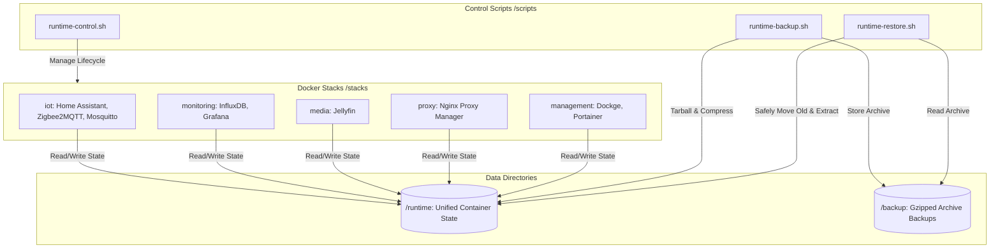

# 🏡 SmartHome Docker Infrastructure

An elegant, modular, and automated home server infrastructure orchestrated using Docker Compose. This repository organizes smart home services, media streaming, proxy routing, monitoring dashboards, and system management into distinct, isolated stacks with a unified data management workflow.

---

## 🏗️ Architecture Overview

The project is structured around a **unified runtime directory** and **automated shell scripts** to manage backups, restorations, and container states smoothly.



---

## 📂 Project Directory Structure

```text
smarthome/
├── backup/                # Generated system backups (Git ignored)
├── runtime/               # Consolidated runtime state for all containers (Git ignored)
├── scripts/               # Automation & orchestration scripts
│   ├── runtime-backup.sh  # Compresses the runtime folder into backup/
│   ├── runtime-control.sh # Starts, stops, or checks docker compose stacks
│   └── runtime-restore.sh # Restores runtime from backups or base templates
└── stacks/                # Isolated docker-compose configurations
    ├── iot/               # Home Assistant, Mosquitto, Zigbee2MQTT
    ├── management/        # Dockge, Portainer
    ├── media/             # Jellyfin media server
    ├── monitoring/        # InfluxDB, Grafana
    └── proxy/             # Nginx Proxy Manager
```

---

## 🚀 The Docker Stacks

Each subdirectory in `stacks/` runs a dedicated environment configured via its own `.env` and `docker-compose.yml` (or `.yaml`) file.

| Stack | Service | Container Name | Port | Host Volume Mount |
| :--- | :--- | :--- | :--- | :--- |
| **`iot`** | **Mosquitto** | `mosquitto` | `1883`, `9001` | `runtime/mosquitto/` |
| | **Zigbee2MQTT** | `zigbee2mqtt` | `8080` | `runtime/zigbee2mqtt/` |
| | **Home Assistant** | `homeassistant` | `8123` | `runtime/homeassistant/` |
| **`management`** | **Dockge** | `dockge` | `5001` | `runtime/dockge/` |
| | **Portainer** | `portainer` | `9443` | `runtime/portainer/` |
| **`media`** | **Jellyfin** | `jellyfin` | `8096` | `runtime/jellyfin/` |
| **`proxy`** | **Nginx Proxy Manager** | `nginx-proxy-manager` | `80`, `81`, `443` | `runtime/npm/` |
| **`monitoring`** | **InfluxDB 2** | `influxdb` | `8086` | `runtime/influxdb/` |
| | **Grafana** | `grafana` | `3000` | `runtime/grafana/` |

---

## 🛠️ Management & Automation Scripts

The orchestration scripts inside `scripts/` automate common administrative operations. Run them from the project root directory.

### 1. Control Services (`runtime-control.sh`)
Start, stop, restart, or check the status of all your Docker stacks in a single command.
```bash
# Check status of all containers across all stacks
./scripts/runtime-control.sh status

# Start all stacks in the background
./scripts/runtime-control.sh start

# Stop all stacks
./scripts/runtime-control.sh stop

# Restart all stacks
./scripts/runtime-control.sh restart
```

### 2. Backup State (`runtime-backup.sh`)
Performs a hot backup of the entire `/runtime` folder, preserving timestamps and directory structures inside a gzipped tarball. It automatically retains a configurable number of old backups (default: 5) and deletes older ones.

```bash
# Run a manual backup with default limit (5 backups)
./scripts/runtime-backup.sh

# Keep a custom number of backups (e.g. 10)
./scripts/runtime-backup.sh -n 10

# Alternatively, using environment variable
MAX_BACKUPS=10 ./scripts/runtime-backup.sh
```
> [!NOTE]
> Backups are saved in the `backup/` directory with a timestamp (e.g. `runtime_2026-05-29_16-15-27.tar.gz`). A symbolic link `latest.tar.gz` is automatically updated to point to the newest backup file. Rotation logic will ensure that only the most recent N timestamped backups are kept.


### 3. Restore / Bootstrap (`runtime-restore.sh`)
Used to restore from a backup or instantiate a clean project from scratch.
```bash
# Restore from the latest backup
./scripts/runtime-restore.sh
```
> [!IMPORTANT]
> - If `backup/latest.tar.gz` exists: The script stops the docker services, renames your existing `runtime/` folder to `runtime_old_<timestamp>` to prevent data loss, extracts the backup, and restarts services.
> - If no backup is found: The script initializes a clean state by copying default template configurations from stack-specific `base_config/` directories into the unified `runtime/` directory.

---

## ⚙️ Configuration & Environment

- **Root Path Binding:** Every stack references `${ROOT}` within its compose file. This points to the absolute directory path of this repository, allowing for clean path declarations across different system setups.
- **Timezone:** Standardized under the `${TZ}` environment variable (default: `Europe/Rome`).
